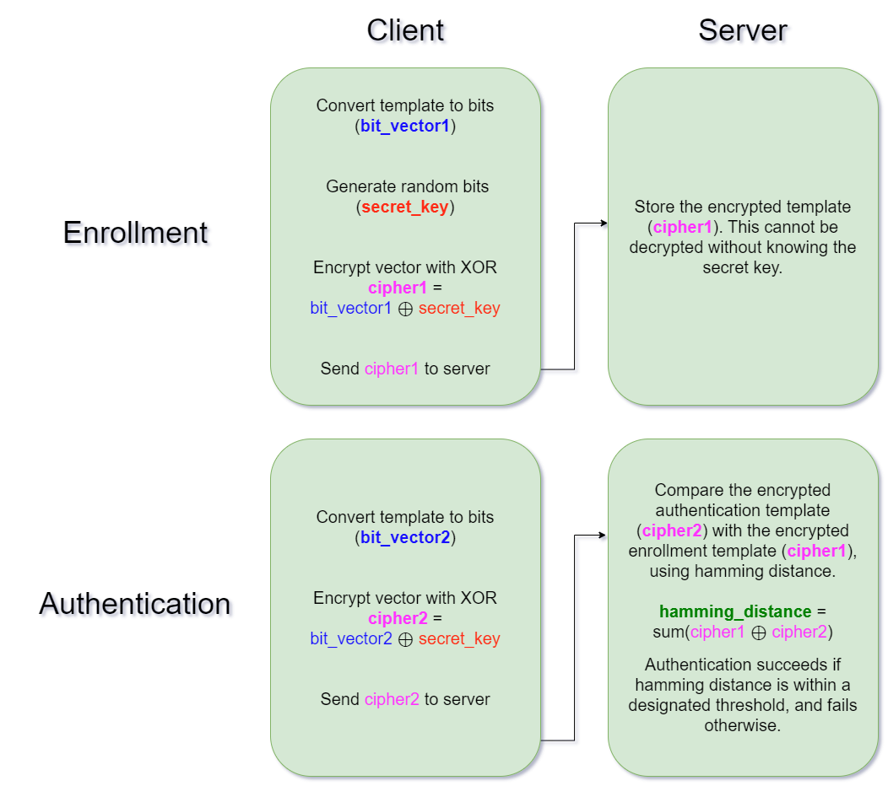

# Basic Biometric Template Protection (BTP) Scheme

## Overview
Biometric Template Protection (BTP) is an important component in biometric systems, aimed at protecting sensitive biometric data from being compromised. However, BTP can often be a complex topic difficult to understand for beginners. This repository provides a **basic and simplified implementation** of a BTP scheme for **educational purposes**. 

My goal is to demonstrate the fundamental concepts of template protection using a simple cryptographic technique, rather than creating a production ready system designed for secure deployment.

## How it Works

This simplified scheme consists of two main phases: **Enrollment** and **Authentication**.

### Enrollment
1. The biometric data (represented as an embedding `embedding1`) is first quantized into a binary vector (`bit_vector1`).
2. A `secret_key` is generated, which is a random binary vector of the same length as `bit_vector1`.
3. The client then encrypts the binarized template by XORing `bit_vector1` with the `secret_key` to create `cipher1`.
4. The client stores the `secret_key` and sends `cipher1` to the server for later authentication.

### Authentication
1. During authentication, a new biometric sample (`embedding2`) is captured and quantized to `bit_vector2`.
2. The client XORs `bit_vector2` with the stored `secret_key` to create `cipher2`.
3. The server calculates the **Hamming distance** between `cipher1` (from enrollment) and `cipher2` (from authentication).
4. If the Hamming distance is below a certain threshold, the user is authenticated.



## Weaknesses
- **Data Leakage**: While the exact bits of the cipher cannot be directly determined without the secret key, the server is able to see which authentication bits differ from the enrollment, which may in time reveal details about the vector's entropy. Particularly, the server can use the differences across several users to determine which bits are reliable, similar to an Attack via Record Multiplicity. Cross-user weaknesses like this can be mitigated by performing a client-side random permutation on the enrollment vector for each user, and storing the permute order for future authentications. 

- **Full Access Adversary**: If the adversary has access to both the client and server, they will be able to decrypt the original enrollment `bit_vector` by performing XOR on the client's `secret_key` and the server's `cipher`.

## Installation

1. Clone the repository:
   ```bash
   git clone https://github.com/templateprotection/basic-btp.git
   cd btp-scheme
   ```

2. Install the required dependencies:
   ```bash
   pip install -r requirements.txt
   ```

4. Run the code:
   ```bash
   python btp.py
   ```
